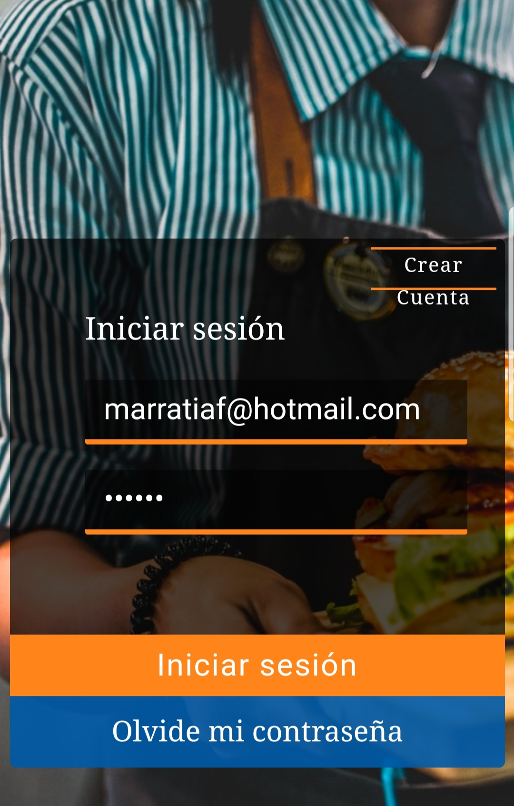

# Burger Queen

## Preámbulo

Burger-queen es un carrito de compras de comida, en donde el mesero podrá hacer los pedidos de los clientes, podrá modificar dichos pedidos, de igual manera podrá lanzar la orden hacia la cocina. Finalmente, esta app puede emitir una boleta básica de los pedidos.

Como punto de partida,
nos comparten el siguiente correo recibido del cliente:

> Somos **Burguer Queen**, una cadena de comida rápida 24hrs.
>
> Nuestra propuesta de servicio 24hrs ha tenido muy buena acogida, y para
> expandirnos necesitamos un sistema que nos ayude a tomar los pedidos de los
> clientes.
>
> Tenemos 2 menús: uno para el desayuno, que es bien sencillo:
>
> | Item                      |Precio|
> |---------------------------|------|
> | Cafe americano            | 500  |
> | Cafe con leche            | 700  |
> | Sandwich de jamón y queso | 1000 |
> | Jugo natural              | 700  |
>
> Y un menú para el resto del dia:
>
> <table width="100%">
>   <tbody>
>     <tr>
>       <td colspan="2" rowspan="1">Hamburguesas</td>
>       <td>Acompañamientos ($500)</td>
>       <td colspan="3" rowspan="1">Bebidas</td>
>     </tr>
>     <tr>
>       <td>Simple</td>
>       <td>$1500</td>
>       <td>Papas fritas</td>
>       <td></td>
>       <td>500ml</td>
>       <td>750ml</td>
>     </tr>
>     <tr>
>       <td>Doble</td>
>       <td>$2500/td>
>       <td>Onion Rings</td>
>       <td>Agua</td>
>       <td>$500</td>
>       <td>$800</td>
>     </tr>
>     <tr>
>       <td></td>
>       <td></td>
>       <td></td>
>       <td>Gaseosa</td>
>       <td>$700</td>
>       <td>$1000</td>
>     </tr>
>   </tbody>
> </table>
>
> Los clientes pueden escoger entre hamburguesas de res, de pollo, o vegetariana.
> **Y por $500 pueden agregarle queso o huevo.**
>
> Nuestros clientes son bastante indecisos, por lo que es muy común que cambien el
> pedido varias veces antes de finalizarlo.

##**PROTOTIPO FINAL**

Finalmente, la interfaz debe estar diseñada específicamente para correr en
**tablets**.

Tópicos: _react_, _angular_, _vue_, _pwa_, _offline-first_, _service-worker_.

##### Definición de terminado
  * Anotar nombre de cliente
  * Agregar productos al pedido
  * Eliminar productos
  * Ver resumen y el total de la compra
  * Enviar pedido a cocina (guardar en alguna base de datos)
  * Se ve y funciona bien en una tablet

## Pistas / Tips

### Frameworks / libraries

* [React](https://reactjs.org/)

### Herramientas

* [npm-scripts](https://docs.npmjs.com/misc/scripts)

### PWA

* [Tu primera Progressive Web App - Google developers](https://developers.google.com/web/fundamentals/codelabs/your-first-pwapp/?hl=es)
* [Progressive Web Apps - codigofacilito.com](https://codigofacilito.com/articulos/progressive-apps)
* [offlinefirst.org](http://offlinefirst.org/)
* [Usando Service Workers - MDN](https://developer.mozilla.org/es/docs/Web/API/Service_Worker_API/Using_Service_Workers)

